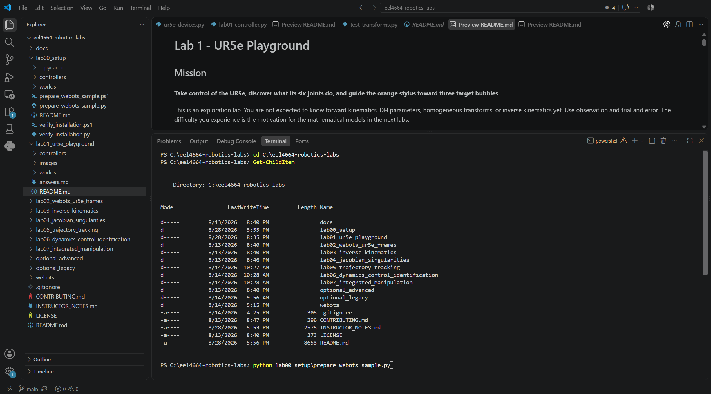
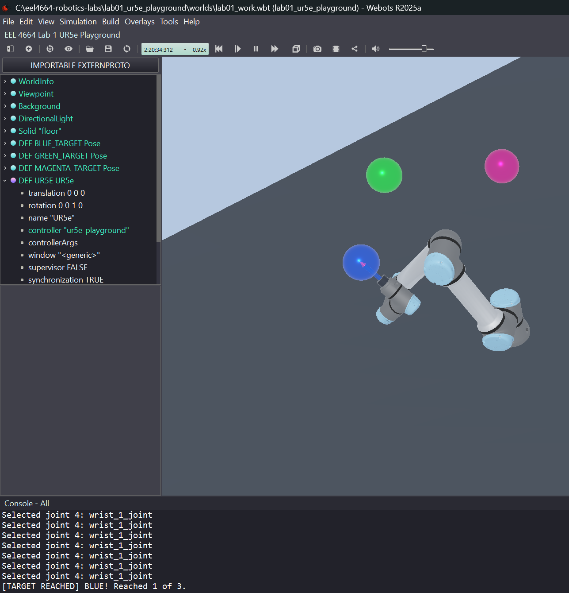

# Lab 1 - UR5e Playground

## Mission

**Take control of the UR5e, discover what its six joints do, and guide the orange stylus toward three target bubbles.**

This is an exploration lab. You are not expected to know forward kinematics, DH parameters, homogeneous transforms, or inverse kinematics yet. Use observation and trial and error. The difficulty you experience is the motivation for the mathematical models in the next labs.

Plan for approximately 45-60 minutes.

## Meet the Real Robot

Before opening Webots, watch [UR5e Cobot with 3D Scanner for Metrology Inspection](https://www.youtube.com/watch?v=8OF0ReM8GA8) (1 minute 48 seconds), published by *Automation World*. It shows a physical UR5e carrying a 3D scanner to inspect a manufactured part.

As you watch, notice:

- how several joints move together to position and orient the tool;
- how the 3D scanner is attached as the robot's tool; and
- why the inspection task requires the robot to control both tool position and orientation.

No written response is required. The video provides a real-world reference for the simulated UR5e you will control in this lab.

## Success Criteria

You have completed the mission when you have explored all six joints, brought the stylus near at least one target, recorded one target-pose joint vector, and can explain why a robot program needs something better than trial and error.

## Learning Objectives

- Operate a UR5e safely in Webots.
- Trace how a Webots controller reads a keyboard event and converts it into a robot action.
- Identify the shoulder, elbow, and wrist joints by observing motion.
- Describe how changing one joint affects the tool.
- Recognize that the effect of a joint depends on the robot's current configuration.
- Explain why an autonomous robot needs a model that predicts tool motion.

## Prerequisite

Complete [Lab 00 - Software Setup and Webots Basics](../lab00_setup/README.md), including Webots Tutorials 1 and 4. No robotics mathematics is required.

## Provided Files

- `worlds/lab01_starter.wbt` - UR5e playground with an orange stylus and three visual target bubbles
- `controllers/ur5e_playground/ur5e_playground.py` - complete keyboard controller with one guided key-mapping change for you to make
- `answers.md` - short observation and reflection template

## Part 1 - Open the Playground

1. Prepare the UR5e model used by this course. The starter world refers to a verified local copy of the official Webots R2025a UR5e model. This command downloads that copy the first time it is needed; rerunning it is safe.

   In VS Code, select **Terminal -> New Terminal**. If you opened the `eel4664-robotics-labs` folder in VS Code as instructed in Lab 00, the terminal normally starts in the repository root. This is the folder containing `README.md`, `lab00_setup`, and `lab01_ur5e_playground`.

   **Windows PowerShell:**

   ```powershell
   cd C:\eel4664-robotics-labs
   Get-ChildItem
   python lab00_setup\prepare_webots_sample.py
   ```

   The Windows example below shows VS Code opened at the correct repository folder. The terminal prompt begins with `PS C:\eel4664-robotics-labs>`, `Get-ChildItem` lists `lab00_setup` and `lab01_ur5e_playground`, and the preparation command finishes with `[READY]`.

   

   **macOS or Ubuntu Terminal:**

   ```bash
   cd ~/eel4664-robotics-labs
   ls
   python3 lab00_setup/prepare_webots_sample.py
   ```

   Before running the Python command, confirm the directory listing includes `README.md`, `lab00_setup`, and `lab01_ur5e_playground`. The preparation is successful when the final message begins with `[READY] Official Universal Robots sample:`.

2. Open `lab01_ur5e_playground/worlds/lab01_starter.wbt` in Webots while the simulation is paused.
3. Immediately select **File -> Save World As...** and create `worlds/lab01_work.wbt` beside the starter.
4. Confirm the UR5e controller is `ur5e_playground`.
5. Press **Run**. Then click anywhere inside the large simulation panel that shows the robot arm, floor, and colored target bubbles. This gives that panel keyboard focus; you do not need to click directly on the robot.

Never overwrite `lab01_starter.wbt`. If the working world becomes damaged, discard it and make a fresh copy from the starter.

## Part 2 - Meet the Six Joints

### Read how the keyboard controller works

Before moving the robot, open `controllers/ur5e_playground/ur5e_playground.py` in VS Code. This is supplied example code. First trace its main flow, and then make the small guided change below. You do not need to submit the controller file.

Find these five stages in the code:

1. `keyboard = robot.getKeyboard()` obtains the Webots keyboard device, and `keyboard.enable(time_step)` enables it.
2. `key = keyboard.getKey()` reads a pending key event. The inner `while key != -1` loop processes all key events waiting in the queue.
3. The `if`/`elif` branches decide what each key means. For example, number keys select a joint, arrow keys change its target, `D` starts the dance, and `S` stops it.
4. `q_command` stores the six desired joint angles. A keyboard action changes either one value in this list or replaces the list with a preset dance pose.
5. The loop containing `motor.setPosition(target)` sends the six desired angles to the six Webots joint motors.

Trace two examples from input to action:

- **Manual motion:** a number key changes `selected`; an arrow key changes `q_command[selected]`; then `motor.setPosition(target)` sends the updated targets to the robot.
- **Dance:** `D` initially sets `dance_active`; the main loop selects poses from `DANCE_POSES`; then the same `motor.setPosition(target)` loop sends each pose to the robot.

Also find the final loop that compares the measured stylus-tip position with `TARGETS` and prints `[TARGET REACHED]`. No response about the code is required in `answers.md`.

### Make one keyboard change

Change the dance-start key from `D` to `M`. This requires two related edits:

1. In the keyboard `if`/`elif` section, find:

   ```python
   elif key in (ord("D"), ord("d")):
   ```

   Change both occurrences of `D` to `M`:

   ```python
   elif key in (ord("M"), ord("m")):
   ```

2. In `print_help()`, change the displayed instruction from `D: start dance` to `M: start dance`. A controller's help text should always agree with its actual key mapping.

Save the file. Return to Webots, press **Reset** to restart the Python controller, press **Run**, and click inside the large simulation panel. Verify that:

- `M` starts the dance;
- `S` stops the dance; and
- `D` no longer starts the dance.

If `D` still starts the dance, confirm that you saved the file and reset Webots after editing it. Do not change any other controller behavior.

### Explore the robot

After completing the guided change, use these keys:

| Key | Action |
|---|---|
| `1`-`6` | select a joint |
| Up / Down arrow | increase / decrease the selected joint target |
| `R` | return to the safe exploration pose |
| `M` | start the short preset robot dance |
| `S` | stop the robot dance |
| `P` | print the current joint angles, stylus position, and target distances |
| `H` | print the controls again |

Move slowly and watch the whole arm, not only the orange tip. If the arm approaches the floor or folds into itself, release the key and press `R`. The controller limits joint targets and motor speed, but you are still responsible for observing the motion.

Explore all six joints. As you move each one, notice which links move and whether the stylus changes position, orientation, or both. These observations are for exploration and do not need to be submitted.

Try one joint from two different robot configurations. Notice that the same joint does not always move the stylus in the same world direction.

## Part 3 - Target-Bubble Challenge

Use trial and error to bring the orange stylus tip near the colored target bubbles. The Console reports when the tip enters a target's 10 cm success region. The bubbles are visual only; they have no collision geometry and cannot damage or push the robot.

The following example shows the stylus tip inside the blue target. The Console confirms success with `[TARGET REACHED] BLUE!`.



Complete these challenges:

1. Reach any one target bubble.
2. Reach a second target without pressing `R` between targets.
3. Press `P` and copy the complete six-number vector `q` for your best target pose. This is a **numerical robot configuration**: one angle for each of the six joints at the same instant.

Optional challenges:

- Reach all three targets in one run.
- Return close to a previous target using the recorded joint angles.
- Find two visibly different arm shapes that place the stylus in approximately the same region.
- Press `M` and explain why the stylus path is more complicated than the individual joint motions.

This is not an accuracy competition. A target attempt that teaches you something about the robot is useful even if it misses.

## Part 4 - Why Do We Need Forward Kinematics?

Complete this short prediction exercise:

1. Press `R` and choose one target bubble.
2. Before touching the arrow keys, pause and predict which joint and direction will move the orange tip toward that target.
3. Try the move and compare what happened with your prediction.
4. Continue toward the target for about 30 seconds. Notice each time you reverse a joint or switch joints because the previous motion did not help. These are trial-and-error corrections.

No written response is required for this exercise.

Trial and error can eventually find a useful pose, but it discovers the result by executing motions whose effects are not known in advance. On a physical robot, an incorrect trial can hit an obstacle, the table, the robot itself, or a nearby person. Trying many motions is also slow, and it does not give a program a repeatable way to determine where a new set of joint angles will place the tool.

An autonomous robot should calculate the expected robot and tool pose **before** executing a command. That prediction can then be used to reject joint values or paths that would hit the table, an obstacle, or the robot itself. Forward kinematics alone does not guarantee a collision-free motion: later checks must consider the shapes of all robot links, the obstacles, and the complete path between poses. The next lab builds the necessary first step by answering:

> Given the six joint angles, how can a program predict the tool position and orientation before the robot moves?

That prediction is **forward kinematics**.

## What to Submit

Submit one completed `answers.md` containing:

1. one screenshot showing the UR5e and a target attempt; and
2. the target color and complete six-value `q` vector printed by `P` for that attempt.

Do not submit controller code, `lab01_work.wbt`, installed software, downloaded vendor assets, or caches.

## Troubleshooting

| Problem | Check |
|---|---|
| UR5e is missing | return to the repository root using the platform-specific command in Part 1, rerun the preparation script, and reopen the world |
| keyboard does nothing | press **Run**, click inside the large simulation panel showing the robot and target bubbles, and press `H` |
| controller is not found | confirm the world is inside this lab's `worlds` folder and the controller is `ur5e_playground` |
| robot enters an awkward pose | release the key and press `R`; reset Webots if needed |
| starter world was changed | restore it with Git and create a new `lab01_work.wbt` |
