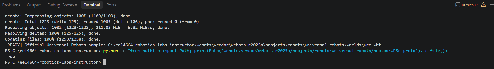
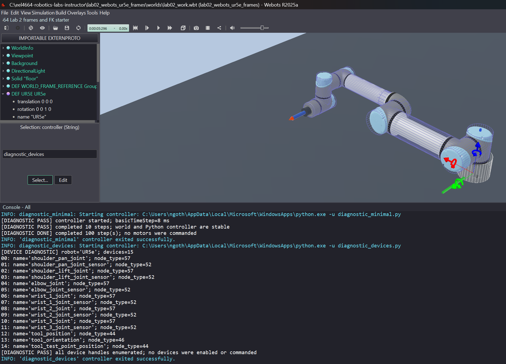
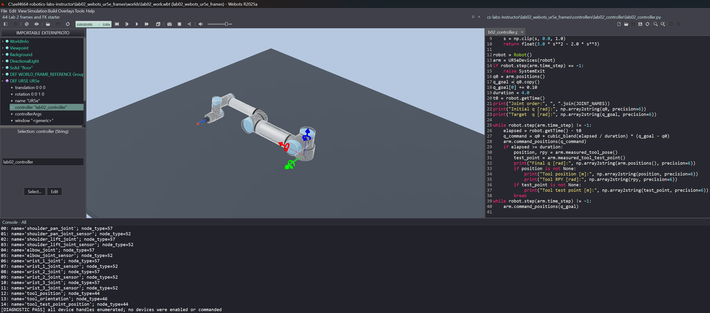

# Lab 2 - UR5e Frames and Forward Kinematics

## Get the Latest Course Files

Before starting the lab, save your work, close Webots, and update the course repository. Open a terminal and use the commands for your operating system.

**Windows PowerShell:**

```powershell
cd C:\eel4664-robotics-labs
git status --short
git pull --rebase
```

**macOS or Ubuntu Terminal:**

```bash
cd ~/eel4664-robotics-labs
git status --short
git pull --rebase
```

A successful update reports either `Already up to date.` or the files that Git updated.

`git status --short` lists local file changes; no output means there are none. `git pull --rebase` downloads new course commits from GitHub and then reapplies any of your local commits after them. It does not submit your work to GitHub. See [What these Git commands mean](../lab00_setup/README.md#what-these-git-commands-mean) for an explanation of Git terminology.

If `git pull --rebase` reports local changes, a conflict, or another error, do not force the update or discard your work. Follow [If the repository cannot update cleanly](../lab00_setup/README.md#if-the-repository-cannot-update-cleanly).

## Mission

**Predict where the UR5e tool will move, watch its stylus air-draw a loop, and test your forward-kinematics model against Webots measurements.**

### Why compare with Webots?

On a physical UR5e, you would calculate the expected tool pose and compare it with an independently measured pose. Because this course does not have access to a physical UR5e, Webots serves as the experimental robot. The comparison tests whether your coordinate-frame choices, transformations, forward kinematics, and fixed tool alignment correctly predict observed motion.

A difference does not automatically mean the FK equations are wrong; it may come from joint tracking, frame alignment, or model conventions. The lab therefore asks you to report these effects rather than judge the result only by appearance.

**Do not save over the original starter world after running the simulation. Reset/revert first, or save into a separate working copy.**

Open `worlds/lab02_starter.wbt` paused and immediately use **File -> Save World As...** to create `worlds/lab02_work.wbt`.

## Success Criteria

You have completed the mission when:

- the world and two quick diagnostics pass;
- the robot completes a safe one-joint motion by Step 3;
- the provided homogeneous-transform utility check passes;
- your UR5e FK returns a valid transform;
- one fixed tool-frame alignment is reused while the robot air-draws through three held-out poses; and
- position, orientation, and tool-point errors are reported quantitatively.

## Learning Objectives

- Identify the UR5e joint order, link sequence, base frame, and tool frame.
- Use provided NumPy rotation and homogeneous-transform utilities in the FK workflow.
- Implement a six-link UR5e FK chain from an explicit DH convention.
- Read ordered Webots joint sensors without using simulator kinematics.
- Validate predicted tool position and orientation against read-only sensors.
- Diagnose errors caused by units, joint order, offsets, and frame conventions.

## Prerequisites

Complete [Lab 1 - UR5e Playground](../lab01_ur5e_playground/README.md). Review coordinate frames, rotation matrices, homogeneous transforms, and the forward-kinematics derivation from lecture.

Tutorials 2 and 3 remain optional in [Optional Webots Basics](../README.md#optional-webots-basics).


**Platform note:** The required workflow supports Windows, macOS, and Ubuntu when configured through Lab 00. Terminal examples use `python`; on macOS or Ubuntu, use `python3` instead if `python` is not recognized.

## Background

A `.wbt` world instantiates the robot and environment. The UR5e PROTO defines its links, joints, motors, sensors, and tool slot. A Python controller repeats:

```text
read sensors -> compute command -> send motor targets -> robot.step()
```

Use radians, meters, seconds, and simulation time from `robot.getTime()`.

| Index | Motor | Position sensor |
|---:|---|---|
| 0 | `shoulder_pan_joint` | `shoulder_pan_joint_sensor` |
| 1 | `shoulder_lift_joint` | `shoulder_lift_joint_sensor` |
| 2 | `elbow_joint` | `elbow_joint_sensor` |
| 3 | `wrist_1_joint` | `wrist_1_joint_sensor` |
| 4 | `wrist_2_joint` | `wrist_2_joint_sensor` |
| 5 | `wrist_3_joint` | `wrist_3_joint_sensor` |

A **point** is a location, such as the tool tip or an object center. A **direction** is an arrow with length and orientation but no fixed location, such as "move along +x" or the direction of a surface normal. The same three numbers can represent either one; their meaning determines how a coordinate transform treats them.

For a point `p_b` expressed in frame `{b}`:

```text
p_a = R_ab p_b + t_ab
[p_a; 1] = T_ab [p_b; 1]
```

The homogeneous coordinate 1 causes the translation column to be added. For example, if a frame moves 2 m in +x, the point `[1, 0, 0]` moves to `[3, 0, 0]` before any rotation is considered.

A free direction has homogeneous coordinate zero:

```text
v_a = R_ab v_b
[v_a; 0] = T_ab [v_b; 0]
```

Multiplying the translation column by zero removes its effect. Translating a frame does not change which way its +x arrow points; only rotation changes a direction.

Webots supplies read-only tool sensors to validate your calculation. It does not perform the transformation for you.

For the UR5e, compute the transform from the base frame `{0}` to frame `{6}` as

$$
{}^{0}T_{6}(\mathbf q)={}^{0}T_{1}(q_1){}^{1}T_{2}(q_2)\cdots{}^{5}T_{6}(q_6).
$$

Use the **modified Denavit-Hartenberg (modified-DH)** matrix given in class:

$$
{}^{i-1}T_i=
\begin{bmatrix}
 c_{\theta_i} & -s_{\theta_i} & 0 & a_{i-1} \\
 s_{\theta_i}c_{\alpha_{i-1}} & c_{\theta_i}c_{\alpha_{i-1}} & -s_{\alpha_{i-1}} & -s_{\alpha_{i-1}}d_i \\
 s_{\theta_i}s_{\alpha_{i-1}} & c_{\theta_i}s_{\alpha_{i-1}} & c_{\alpha_{i-1}} & c_{\alpha_{i-1}}d_i \\
 0 & 0 & 0 & 1
\end{bmatrix}.
$$

Here, $c_{\theta_i}=\cos(\theta_i)$, $s_{\theta_i}=\sin(\theta_i)$, and similarly for $\alpha_{i-1}$. You do not need to derive this matrix in the lab. Instead, compare it carefully with the supplied NumPy matrix and complete two missing entries.

Use this modified-DH table in meters and radians:

| Joint $i$ | $\alpha_{i-1}$ | $a_{i-1}$ | $d_i$ | $\theta_i$ |
|---:|---:|---:|---:|---|
| 1 | 0 | 0 | 0.1625 | $q_1$ |
| 2 | $\pi/2$ | 0 | 0 | $q_2$ |
| 3 | 0 | -0.4250 | 0 | $q_3$ |
| 4 | 0 | -0.3922 | 0.1333 | $q_4$ |
| 5 | $\pi/2$ | 0 | 0.0997 | $q_5$ |
| 6 | $-\pi/2$ | 0 | 0.0996 | $q_6$ |

The subscripts matter: `alpha_previous` and `a_previous` in the Python code follow the same column order and mean $\alpha_{i-1}$ and $a_{i-1}$, while `d` and `theta` mean $d_i$ and $\theta_i$. The values are the nominal UR5e dimensions published by [Universal Robots](https://www.universal-robots.com/articles/ur/application-installation/dh-parameters-for-calculations-of-kinematics-and-dynamics), rearranged for the modified-DH convention used in class. The pinned Webots geometry contains rounded dimensions, so a small residual is expected.

Relate the DH result to the measured tool frame explicitly:

```text
T_world_tool = T_world_0 T_0_6(q) T_6_tool
```

### How to read a transform chain

The notation `T_a_b` means "convert coordinates from frame `{b}` into frame `{a}`." Therefore:

- `forward_kinematics(q_goal)` returns `T_0_6`: the pose of DH frame `{6}` relative to base frame `{0}`;
- `T_6_tool` converts from the tool frame to frame `{6}`; and
- multiplying them gives `T_0_tool`, the tool pose relative to the base.

```python
T_0_tool = forward_kinematics(q_goal) @ T_6_tool
```

The NumPy `@` symbol means matrix multiplication. Read the chain from right to left: first convert tool coordinates into frame `{6}`, then convert frame `{6}` coordinates into frame `{0}`. The adjacent frame labels match and "cancel":

```text
T_0_6 T_6_tool = T_0_tool
      ^ ^
      same intermediate frame
```

Order matters. In general, `T_0_6 @ T_6_tool` is not equal to `T_6_tool @ T_0_6`. Use `@` for transform composition; do not use `*`, which performs element-by-element multiplication in NumPy.

In the supplied world, the robot base has zero world translation/rotation, so `T_world_0` is identity. Consequently, `T_world_tool` and `T_0_tool` have the same numerical value in this lab. Determine `T_6_tool` once from the alignment configuration and keep it unchanged for every validation configuration.


## Provided Files

- `worlds/lab02_starter.wbt` - protected UR5e world with stylus, validation sensors, and a compact world-frame reference
- `controllers/diagnostic_minimal/` - confirms that Python starts
- `controllers/diagnostic_devices/` - lists the required devices
- `controllers/eel4664_ur5e/` - safe one-joint motion and Webots device adapter
- `controllers/fk_experiment/` - ready-to-run FK prediction and air-drawing challenge
- `src/transforms.py` and `src/transform_point.py` - complete, commented transform utilities
- `src/test_transforms.py` - short offline transform test
- `src/ur5e_fk_starter.py` - DH table and student FK starter
- `src/read_configuration.py` and `src/query_transform.py` - optional debugging helpers, not required in the main workflow
- `answers.md` - concise response template

## Part 1 - Setup / Validation: Get the Robot Moving

The robot moves in Step 3. Complete Steps 1-2 quickly, but stop if either diagnostic fails.

### Step 1 - Prepare and open the working world

1. Open a terminal and go to the repository.

   Windows PowerShell:

   ```powershell
   cd C:\eel4664-robotics-labs
   ```

   macOS or Ubuntu Terminal:

   ```bash
   cd ~/eel4664-robotics-labs
   ```

   The commands below use `python`. On macOS or Ubuntu, use `python3` if needed, as explained in Lab 00.

2. Close Webots and prepare the pinned R2025a UR5e assets:

   ```bash
   python lab00_setup/prepare_webots_sample.py
   python -c "from pathlib import Path; print(Path('webots/vendor/webots_r2025a/projects/robots/universal_robots/protos/UR5e.proto').is_file())"
   ```

   The cross-platform script downloads one known-good copy of the official R2025a UR5e model and its dependencies inside the repository. It does not use the installed Webots asset paths. The first command should end with `[READY] Official Universal Robots sample:` and the final command must print `True`.


*Example successful result. The download finishes with `[READY]`, and the file check prints `True`. The repository path shown in your terminal may be different; the two success indicators are what matter.*

3. Start Webots R2025a while paused and open `lab02_webots_ur5e_frames/worlds/lab02_starter.wbt` from your repository.

4. Confirm the complete robot and floor are visible immediately, without zooming or rotating. The short blue stylus and compact colored world-frame axes should be visible, and the robot controller should be `void`.
5. Immediately select **File -> Save World As...** and save `lab02_work.wbt` beside the starter.
6. Confirm the title bar shows `lab02_work.wbt`.

**Never overwrite `lab02_starter.wbt`.** Make all controller assignments in the working copy. If you created `lab02_work.wbt` before the stylus was added, discard that old working copy and create a fresh one from the updated starter.

### Step 2 - Run two quick diagnostics

To assign a controller, select `UR5e "UR5E"` in the Scene Tree, double-click its `controller` field, choose the controller name, press **Reset**, and then press **Run**.

Run the controllers in this order:

| Controller | What it checks | Expected result | Movement? |
|---|---|---|---|
| `diagnostic_minimal` | Webots can start the configured Python interpreter, load a controller, and advance the world through simulation steps | Console prints `[DIAGNOSTIC PASS] completed 10 steps` and then `[DIAGNOSTIC DONE]` | none |
| `diagnostic_devices` | The UR5e model exposes the device names that later controllers will request | Console lists 15 devices and ends with `[DIAGNOSTIC PASS] all device handles enumerated` | none |

The minimal diagnostic deliberately does almost nothing. It creates the Webots `Robot` object, reads the basic time step, advances the simulation briefly, and exits normally. It does not obtain motor handles or send commands. If it fails, investigate Python configuration, the controller folder, or the world before debugging any robotics mathematics.

The device diagnostic asks Webots for the names and node types of every device attached to the UR5e. Confirm that the list contains six motors, six joint sensors, `tool_position`, `tool_orientation`, and `tool_test_point_position`. It only enumerates handles: it does not enable sensors, change motor targets, or move the robot. If the minimal test passes but this test fails, the likely problem is the robot model, device names, or prepared assets rather than Python itself.



*Example successful result. The Console first shows the minimal controller completing normally, followed by the device controller finding all 15 expected handles. The blue outlines only indicate that the UR5e is selected in the Scene Tree; they are not an error. No robot movement is expected during either diagnostic.*

Continue to Step 3 only after both diagnostics pass. If either fails, use the Troubleshooting section before running motion code.
### Step 3 - Move one joint and save the alignment data

If `controllers/lab02_controller` does not already exist, close Webots and run this cross-platform command from the repository root:

```bash
python -c "from pathlib import Path; import shutil; src=Path('lab02_webots_ur5e_frames/controllers/eel4664_ur5e'); dst=Path('lab02_webots_ur5e_frames/controllers/lab02_controller'); shutil.copytree(src,dst); (dst/'eel4664_ur5e.py').rename(dst/'lab02_controller.py')"
```

Confirm `lab02_controller.py` contains:

```python
q_goal = q0.copy()
q_goal[0] += 0.10
duration = 4.0
```


*Example immediately before the Step 3 motion test. The title bar shows the working copy `lab02_work.wbt`, the UR5e `controller` field is `lab02_controller`, and the editor shows the small `q_goal[0] += 0.10` command. Keep the simulation paused until you have made the prediction in item 2. Console lines from the earlier device diagnostic may still be visible; they are not the Step 3 motion result.*

1. Open `lab02_work.wbt` and assign `lab02_controller`.
2. Before running, predict which links will move and in which direction.
3. Press **Reset**, then **Run**.
4. Confirm the shoulder-pan joint moves smoothly by approximately +0.10 rad while the other joint targets remain at their measured starting values.
5. Copy these final Console values into `answers.md`:
   - six measured joint angles `q_align` with at least six decimal places;
   - tool position `[x, y, z]`;
   - tool orientation `[roll, pitch, yaw]`; and
   - tool test-point position.

These synchronized final measurements are the one alignment data set used later. Do not calculate anything yet - first get the robot moving and preserve the measurements.

## Part 2 - Core Implementation

### Step 4 - Verify the provided transform utilities

`src/transforms.py` and `src/transform_point.py` are complete support files. **Do not modify them.** You are not required to implement or answer questions about `rotx`, `roty`, or `rotz` in this lab.

From the repository root, run this short check:

```bash
python lab02_webots_ur5e_frames/src/test_transforms.py
```

Expected output:

```text
All transformation tests passed.
```

This check only confirms that the provided rotation and homogeneous-transform utilities work. Your required FK coding begins in Step 5: complete the two marked entries in the modified-DH matrix.

### Step 5 - Implement forward kinematics

The Background section gives the modified-DH matrix, parameter table, and frame order. Open `src/ur5e_fk_starter.py`. The matrix and the six-transform multiplication loop are already provided. Complete only these two marked entries:

- `row_2_column_1`; and
- `row_3_column_4`.

Before editing the two entries, examine the provided `forward_kinematics(q)` function:

```python
T = np.eye(4)
for qi, (alpha_previous, a_previous, d, offset) in zip(q, UR5E_MDH):
    T = T @ dh_transform(alpha_previous, a_previous, d, qi + offset)
return T
```

This loop **chains six transformations**. It starts with the identity `T_0_0`. After the first iteration, `T` is `T_0_1`. The second iteration appends `T_1_2` on the right, producing `T_0_2 = T_0_1 T_1_2`. The same process continues until the sixth iteration returns `T_0_6`, the pose of frame `{6}` relative to the base frame `{0}`:

```text
T_0_6 = T_0_1 T_1_2 T_2_3 T_3_4 T_4_5 T_5_6
```

The order is essential because matrix multiplication is not commutative. Each transform must connect the current frame to the next physical link. The chaining loop is already complete; students modify only the two marked entries inside `dh_transform()`.

Use the class formula to decide which products of sine, cosine, and `d` belong in those locations. Do not copy a robotics-library FK function. In `answers.md`, write the two expressions you inserted and explain the frame multiplication order. Then run:

```bash
python -c "import numpy as np; from lab02_webots_ur5e_frames.src.ur5e_fk_starter import forward_kinematics; T=forward_kinematics(np.zeros(6)); print(T); print('orthogonality=',np.linalg.norm(T[:3,:3].T@T[:3,:3]-np.eye(3))); print('det=',np.linalg.det(T[:3,:3]))"
```

This command performs a quick FK check without opening Webots:

- `python -c "..."` asks Python to execute the code between the quotation marks directly from the terminal.
- `import numpy as np` loads NumPy, and the next import loads your `forward_kinematics` function.
- `np.zeros(6)` creates `q = [0, 0, 0, 0, 0, 0]` rad, the zero-joint test configuration.
- `T = forward_kinematics(...)` evaluates your six-link transform chain and stores the resulting 4-by-4 matrix.
- `print(T)` displays the complete transform.
- `T[:3, :3]` extracts its 3-by-3 rotation matrix `R`.
- `norm(R.T @ R - I)` measures how closely `R` satisfies `R^T R = I`. A proper rotation should give a value very close to zero.
- `det(R)` checks whether `R` is a proper rotation rather than a reflection. Its determinant should be close to `+1`.

Pass conditions:

- `T` is 4-by-4 with last row `[0, 0, 0, 1]`;
- rotation orthogonality error is below `1e-8`; and
- the rotation determinant is within `1e-8` of 1.

Now run the complete command for a nonsymmetric configuration:

```bash
python -c "import numpy as np; from lab02_webots_ur5e_frames.src.ur5e_fk_starter import forward_kinematics; T=forward_kinematics(np.array([0.20,-0.80,1.00,-1.10,-0.70,0.30])); print(T); print('orthogonality=',np.linalg.norm(T[:3,:3].T@T[:3,:3]-np.eye(3))); print('det=',np.linalg.det(T[:3,:3]))"
```

Why run a second configuration? At `q = 0`, many sine terms are zero and cosine terms are one. A missing sign, misplaced term, or incorrect joint variable can therefore be hidden by the unusually simple zero configuration. The second vector gives every joint a different nonzero angle, so more terms in the DH matrices become active and mistakes are more likely to produce an obviously different result.

Both runs must satisfy the pass conditions, and you should record both matrices and checks in `answers.md`. These checks show that the result has the structure of a rigid transform, but they do not by themselves prove that it is the correct UR5e transform. The later comparison with Webots provides the experimental check of the FK model. Webots must not be used to calculate FK.

### Step 6 - Determine the fixed tool transform once

The DH calculation ends at frame `{6}`, while Webots measures the tool frame. Their constant relationship is `T_6_tool`:

```text
T_world_tool = T_world_6 T_6_tool
T_6_tool = inverse(T_world_6) T_world_tool
```

Use only the alignment data recorded in Step 3. Create a small analysis script from this pattern and replace each `...` with the recorded numbers:

```python
import numpy as np
from lab02_webots_ur5e_frames.src.transforms import (
    homogeneous, invert_transform, rotx, roty, rotz
)
from lab02_webots_ur5e_frames.src.ur5e_fk_starter import forward_kinematics

q_align = np.array([...])
origin_world = np.array([...])
rpy_world_tool = np.array([...])

roll, pitch, yaw = rpy_world_tool
R_world_tool = rotz(yaw) @ roty(pitch) @ rotx(roll)
T_world_tool_measured = homogeneous(R_world_tool, origin_world)
T_world_6 = forward_kinematics(q_align)  # T_world_0 is identity
T_6_tool = invert_transform(T_world_6) @ T_world_tool_measured
print(np.array2string(T_6_tool, precision=8, suppress_small=True))
```

Save the printed 4-by-4 matrix in `answers.md`. This is a one-time frame alignment. Reuse it unchanged at every validation pose; recomputing it would hide FK errors.

## Part 3 - Robot Experiment

### Step 7 - Predict, air-draw a loop, and compare three poses

The provided `fk_experiment` controller moves the UR5e through Poses A, B, and C, then returns to A to close an air-drawn loop. The supplied visual stylus is centered on the wrist flange and extends 0.13 m along the Webots tool frame's +y axis. Its bright orange tip marks `p_tool = [0, 0.13, 0]` m, making the motion easy to follow and tying the visual experiment to Step 8. It has no collision geometry or physics, so it cannot contact or disturb the environment. This is air drawing: the tip shows the path while moving but does not leave a permanent line. Do not edit the targets.

| Pose | Commanded `q_goal` [rad] |
|---|---|
| A | `[0.0, -1.20, 1.20, -1.50, -1.57, 0.0]` |
| B | `[0.20, -0.80, 1.00, -1.10, -0.70, 0.30]` |
| C | `[-0.30, -0.90, 1.10, -1.40, -1.20, -0.20]` |

#### Predict before running Webots

For each commanded `q_goal`, calculate:

```python
T_world_tool_predicted_from_q_goal = forward_kinematics(q_goal) @ T_6_tool
p_world_tool_predicted_from_q_goal = T_world_tool_predicted_from_q_goal[:3, 3]
```

Record the three predicted tool positions before starting the controller. Also make a simple qualitative prediction for A to B, B to C, and C back to A: will the tool move mainly left/right, forward/backward, or up/down? These are genuine predictions; do not look at Webots measurements first.

#### Watch the robot execute the experiment

1. Open `lab02_work.wbt` and leave it paused.
2. Select `UR5e "UR5E"`, double-click its `controller` field, and choose `fk_experiment`.
3. Press **Reset** and visually confirm that the arm's workspace is clear.
4. Press **Run** and follow the orange stylus tip as the robot moves A -> B -> C -> A. Each smooth move takes eight seconds, followed by a short settling pause.
5. Confirm that the stylus tip returns to its starting point and the Console finishes with:

   ```text
   [LOOP CLOSED] Returned to Pose A.
   [EXPERIMENT DONE] Air-drawn loop A -> B -> C -> A completed.
   ```

6. Copy the labeled measurement block for Poses A, B, and C into your results. Each block contains measured `q`, tool position, tool RPY, and tool-test-point position. The return to A is a visual closure check, so the controller does not print a duplicate measurement block for it.

The three robot-motion segments may look curved rather than perfectly straight. This controller interpolates the six **joint angles**, so it does not command a straight Cartesian tool path. Generating and tracking straight tool-space paths is a later trajectory-planning objective.

#### Make the quantitative comparison

Commanded and measured joint angles can differ slightly. For the final accuracy calculation, recompute each prediction with the **measured** joint vector printed at that pose:

```python
T_world_tool_predicted_from_q_measured = forward_kinematics(q_measured) @ T_6_tool
```

Compare this result with the Webots tool measurement. Keep the pre-run commanded-angle prediction as evidence that you predicted the motion before observing it. Do not change the DH parameters or `T_6_tool` after seeing Poses A-C.

### Step 8 - Check a point attached to the tool

For Pose C, use:

```python
p_tool = np.array([0.0, 0.13, 0.0])
p_world_predicted = transform_point(T_world_tool_predicted_from_q_measured, p_tool)
```

Compare this prediction with the printed `tool_test_point_position`. This checks the predicted tool orientation and translation together.

## Part 4 - Quantitative Analysis

For Poses A-C, compute:

```text
position_error = ||p_predicted - p_measured||_2
R_error = R_predicted^T R_measured
orientation_error = acos(clamp((trace(R_error) - 1) / 2, -1, 1))
```

Submit one four-row table: the alignment row plus three held-out validation rows. Include measured `q`, predicted/measured tool position, position error in millimeters, and orientation error in degrees. Clearly mark the alignment row and exclude it from held-out error statistics.

Report:

- mean and maximum position error over Poses A-C;
- mean and maximum orientation error over Poses A-C;
- Pose C tool-test-point error; and
- one plot comparing position and orientation error across A-C.

Briefly explain whether the remaining error is more consistent with rounded model dimensions, a constant frame error, or an incorrect joint/transform convention.

## Engineering Questions

1. Why must joint order and transform multiplication order be explicit?
2. What physical relationship does each row of the DH table describe?
3. Why must `T_6_tool` remain fixed for Poses A-C?
4. Why should FK use measured joint angles instead of commanded targets?
5. What error pattern would suggest a wrong joint sign or transform order?

## What to Submit

1. Completed `ur5e_fk_starter.py`.
2. Completed `answers.md`, containing the DH convention, fixed alignment transform, pre-run predictions, comparison table, required errors and summary, one error plot, and answers to the Engineering Questions.

Do not submit `lab02_work.wbt`, installed software, downloaded vendor assets, or caches unless requested.

## Troubleshooting

| Last passing stage | First failing stage | Likely problem |
|---|---|---|
| none | world opens | missing vendor assets or damaged world |
| world | minimal controller | Webots Python command or controller discovery |
| minimal | device diagnostic | wrong working world or missing devices |
| devices | one-joint motion | joint order, target, or controller copy |
| transform test | FK structural test | DH matrix or multiplication order |
| FK test | alignment | RPY order or frame-chain direction |
| alignment | held-out poses | joint sign/order, DH convention, or changing `T_6_tool` |

Recovery:

1. Pause Webots and save needed code or measurements.
2. Reopen `lab02_starter.wbt` directly and create a fresh working copy.
3. Repeat `diagnostic_minimal -> diagnostic_devices -> one-joint motion`.
4. Test FK outside Webots before returning to the experiment.
5. Reuse the original Step 3 alignment; do not recalibrate on a validation pose.

For repeated crashes or safe mode, see [Troubleshooting Webots](../docs/TROUBLESHOOTING_WEBOTS.md).
